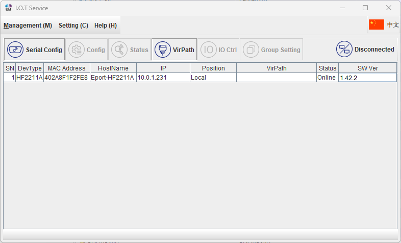
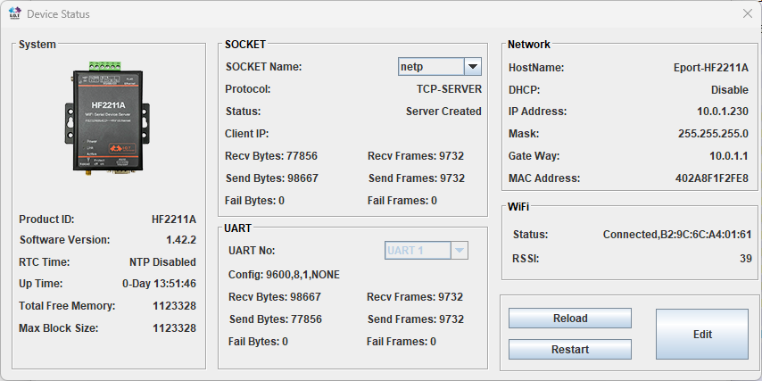
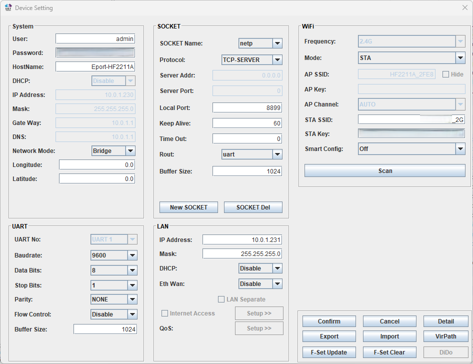
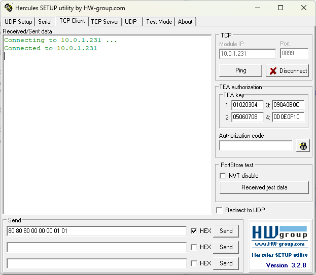
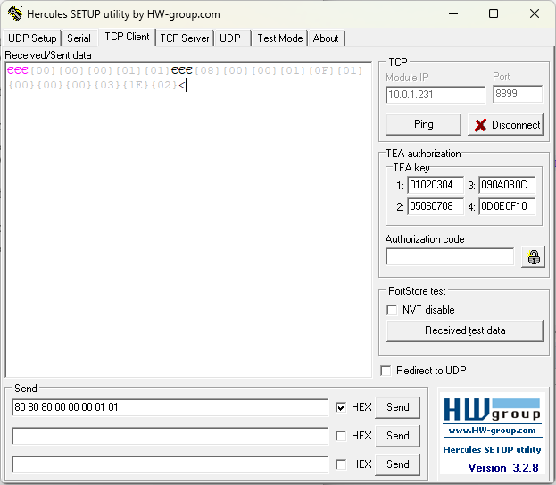

# README

## Purchases

- HF2211 IoT server
- Power source for the above, if not included
- RJ45 cable for the connection between the inverter and HF2211

## HF2211 setup

Easiest installation with manufacturer's tool, though web UI can also be used.

Startup screen with device found:

Status screen:

Final settings:

## Cabling

First check that the cable is a standard CAT 5/6 cable having the standard colours.

The following ones are needed, so strip those and optionally solder.

| Wire colour | HF2211A terminal |
| --- | --- |
| Blue | RXA (RX+) |
| White/blue | RXB (RX-) |
| White/green | TXA (TX+) |
| Green | TXB (TX-) |
| Orange | GND |

These are not needed, but are connected on the Fronius end, so tape or cover them safely:

- White/orange
- White/brown
- Brown

## Connectivity testing

Hercules: <https://www.hw-group.com/software/hercules-setup-utility>

Connection:

Command execution (sample commands below); notice the HEX checkmark:

Sample commands below, notice that the first one is a broadcast and as such a good way for checking that the connection works. Sent command is shown as characters in purple and response in blue.

| Command | Hex bytes |
| --- | --- |
| Get version (broadcast) | `80 80 80 00 00 00 01 01` |
| Get active inverter count | `80 80 80 00 00 00 04 04` |
| Get current power (inverter #1) | `80 80 80 00 01 01 10 12` |
| Get DC voltage (inverter #1) | `80 80 80 00 01 01 15 17` |
| Get DC current (inverter #1) | `80 80 80 00 01 01 14 16` |
